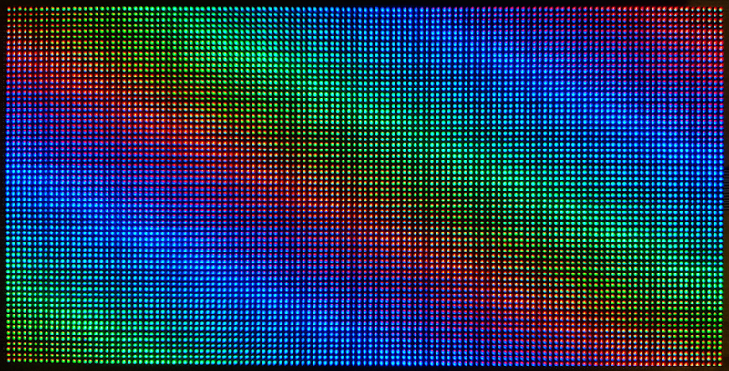

# ICN2053_ESP32_LedWall

An Arduino implementation to drive ICN2053 based LED wall segments running on the ESP32 platform.

*Example of a 128x64 LED video wall*

Unfortunately there is no infromation on the internet on the configuration data needed to initialize the ICN2053 chips.

@ElectronicsInFocus figured it out though and i have no clue how: [Youtube](https://www.youtube.com/watch?v=nhCGgTd7OHg). This code is in wide areas based on his example implementation.

## Prerequisites

* [Arduino](https://www.arduino.cc/en/Main/Software)
* [Arduino core for ESP32](https://github.com/espressif/arduino-esp32)

## Install

* Either run `git clone git@github.com:SebiTimeWaster/ICN2053_ESP32_LedWall.git` or download the ino file.
* If you use [Visual Studio Code](https://code.visualstudio.com/) with the [Arduino Plugin](https://github.com/Microsoft/vscode-arduino) copy the "arduino.json" file from the "VSCode_Arduino_plugin" directory int your workspaces' ".vscode" directory and edit it (Change the browse path).

## Specifics of the ESP32

* 32-bit 2 core cpu with 240 Mhz
* WiFi: 802.11 b/g/n/e/i (802.11n @ 2.4 GHz up to 150 Mbit/s)
* Bluetooth: v4.2 BR/EDR and Bluetooth Low Energy (BLE)
* http://esp32.net/

## Specifics of the ICN2053

* 16-Channel PWM Constant Current LED Sink Driver
* Supports time-multiplexing for 1~32 scan lines
* http://en.chiponeic.com/content/details36_410.html

## Specifics and caveats of this implementation

* TBD
